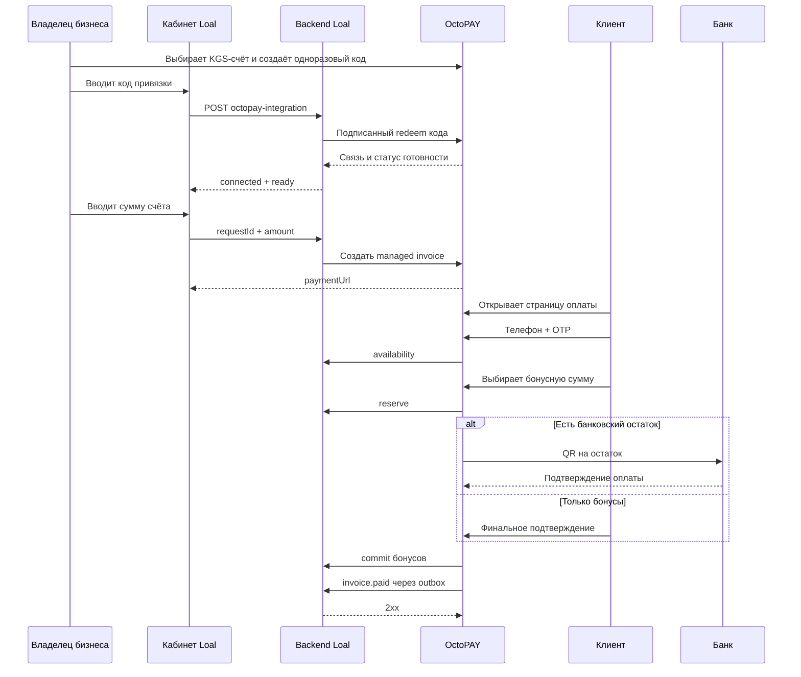

# Интеграция Loal ↔ OctoPAY

## Технический отчёт по реализации в трёх репозиториях

**Дата фиксации:** 1 октября 2026 года

**Статус:** реализовано, изменения разбиты между backend Loal, web-приложениями Loal и OctoPAY

**Назначение документа:** зафиксировать итоговую архитектуру, пользовательские сценарии, API, изменения данных, правила безопасности, порядок развёртывания и известные способы диагностики.

---

## 1. Краткий итог

Реализована сквозная интеграция Loal и OctoPAY, в которой бизнес привязывает свой магазин Loal к конкретному банковскому счёту OctoPAY, кассир выставляет клиенту счёт только по сумме, а сам клиент на странице оплаты OctoPAY решает, использовать ли бонусы Loal полностью, частично или не использовать их.

Главные результаты:

- магазин Loal связывается с OctoPAY безопасным одноразовым кодом;
- при наличии нескольких активных KGS-счетов владелец сам выбирает счёт получения денег;
- кассиру больше не нужно вводить телефон клиента;
- телефон и OTP вводит сам плательщик на странице OctoPAY;
- доступны три варианта оплаты: банк, только бонусы, бонусы + банк;
- бонусы сначала резервируются, затем подтверждаются или освобождаются;
- повторные запросы и повторные callback-события не создают второй счёт и не списывают бонусы повторно;
- платежи привязываются к исходному кассиру и филиалу;
- старые счета и старый webhook сохранены, но не могут обойти правила нового managed-потока;
- название товара в ручном кассовом списании стало необязательным и по умолчанию превращается в `Покупка`;
- добавлены восстановление после частичных сбоев, версия QR, outbox доставки финального события и reconciliation-задача.

---

## 2. Репозитории и контрольные ревизии

| Система | Репозиторий | Ветка | Последний коммит серии |
|---|---|---:|---|
| OctoPAY: счета, страница оплаты, банки, OTP и settlement | `octopay` | `main` | `e22b0bf` — `feat: select Loal receiving account` |
| Backend Loal/Cashup: карты, бонусы, интеграции, события | `cashup_platform` | `master` | `5d63431` — `test: document selected Octopay accounts` |
| Web Loal: кабинет партнёра и кассира | `cashup-landing` | `main` | `adbc934` — `fix: explain Loal account selection` |

В этой таблице указаны контрольные коммиты функциональной серии, а не гарантия того, что конкретный сервер уже работает именно на них. Версию на сервере нужно проверять через `git rev-parse HEAD`, состояние CI/CD и фактически запущенный процесс или контейнер.

---

## 3. Что было до и что стало после

| Область | Было | Стало |
|---|---|---|
| Привязка бизнеса | Использование общих реквизитов/ручной конфигурации | Одноразовый код OctoPAY, который связывает конкретный OctoPAY-бизнес с магазином Loal |
| Банковский счёт | Не было надёжно закреплённого счёта либо ожидался единственный KGS-счёт | Владелец выбирает конкретный активный и пригодный KGS-счёт до генерации кода |
| Данные кассира | Для выставления счёта требовался телефон клиента | Кассир вводит только сумму; телефон вводит клиент на странице оплаты |
| Идемпотентность счёта | Повтор после timeout мог быть неоднозначным | Один `requestId` создаётся на попытку и безопасно повторяется до подтверждённого успеха |
| Использование бонусов | Отдельное списание без безопасного split-payment | `availability → reserve → commit/cancel`, включая смешанную оплату |
| Банковский QR | Один QR без строгой привязки к версии суммы | Каждая смена бонусной части создаёт новую версию QR и ожидаемой банковской суммы |
| Завершение платежа | Банк или старый webhook могли сразу пометить счёт оплаченным | Общий settlement проверяет банк, бонусный резерв, версию QR и точную разбивку |
| Финальная синхронизация | Legacy webhook мог инициировать полное бонусное списание | Отдельное подписанное `invoice.paid` подтверждает уже совершённое списание, не создавая второе |
| Название товара | Обязательно в ручном списании | Необязательно; пустое значение нормализуется в `Покупка` |
| Восстановление | Ограниченная обработка промежуточных ошибок | Reconciliation, повтор commit/cancel, durable outbox и безопасные `processing/review` состояния |

---

## 4. Границы ответственности

### Loal/Cashup отвечает за

- клиента и его карту лояльности;
- бонусный баланс и ограничения магазина;
- резерв, commit, cancel и истечение резерва;
- единственную ledger-транзакцию списания;
- подписку магазина и процент допустимого покрытия;
- магазин, филиал и пользователя, выставившего счёт;
- финальное состояние локального клиентского платежа.

### OctoPAY отвечает за

- OctoPAY-бизнес и его банковские счета;
- создание счёта и публичную страницу оплаты;
- выбор закреплённого KGS-счёта;
- банковский QR и callback/reconciliation банков;
- идентификацию плательщика Loal через OTP;
- выбор бонусной суммы клиентом;
- координацию смешанной оплаты;
- доставку финального события в Loal.

### Принцип доверия

Браузер не обращается к server-to-server API бонусов напрямую и не решает, оплачен ли счёт. Доверенные вызовы идут между backend-системами, подписываются HMAC и повторно проверяются на стороне получателя.



---

## 5. Полный пользовательский сценарий

### 5.1. Первичная привязка бизнеса

1. Владелец открывает интеграцию Loal в кабинете OctoPAY.
2. OctoPAY загружает активные KGS-счета бизнеса и показывает только допустимые варианты.
3. Если подходящий счёт один, он может быть рекомендован автоматически. Если их несколько, владелец обязан явно выбрать нужный.
4. Для неготовых счетов показывается причина; выбрать их нельзя.
5. OctoPAY создаёт одноразовый код формата `loal_link_...`, связанный именно с выбранным `bankAccountId`.
6. Владелец вставляет код в блок интеграции OctoPAY в кабинете Loal.
7. Backend Loal подписанным запросом погашает код в OctoPAY.
8. OctoPAY повторно проверяет бизнес и выбранный счёт внутри транзакции, помечает код использованным и создаёт либо обновляет связь.
9. Кабинет Loal показывает состояние `connected`, `ready`, имя бизнеса и дату подключения.

Код действует 15 минут, используется один раз, хранится в OctoPAY только как SHA-256 hash и не должен попадать в URL, аналитику, `localStorage` или логи.

### 5.2. Повторная привязка при нескольких счетах

Старые связи могли не иметь `bankAccountId`. Для них действует совместимость:

- если подходящий активный KGS-счёт ровно один, OctoPAY может использовать безопасный exact-one fallback;
- если счетов несколько, состояние становится неготовым с причиной `KGS_BANK_ACCOUNT_AMBIGUOUS`;
- владелец выбирает счёт в OctoPAY, создаёт новый код, отключает старую связь в Loal и подключает интеграцию заново;
- после этого `ready=true` допустим и при двух или более активных KGS-счетах, потому что связь уже указывает на конкретный счёт.

### 5.3. Выставление счёта

1. Кассир или владелец открывает «Счёт клиенту».
2. Форма проверяет готовность интеграции.
3. Пользователь вводит только сумму.
4. Frontend создаёт UUID `requestId` один раз для этой попытки.
5. При timeout или неопределённом ответе повтор отправляется с тем же UUID.
6. Только после подтверждённого успеха создаётся новый UUID для следующего счёта.
7. Backend Loal создаёт локальную запись и подписанным запросом создаёт managed invoice в OctoPAY.
8. OctoPAY использует `bankAccountId`, сохранённый в связи; браузер и Loal не передают реквизиты банка.
9. Кассир получает ссылку, копирует её и отправляет клиенту.

Новое тело запроса:

```json
{
  "requestId": "11111111-1111-4111-8111-111111111111",
  "amount": 500
}
```

Телефон в новом UI отсутствует. Старое поле `clientPhone` временно принимается backend Loal для совместимости, но OctoPAY канонизирует его в `null`, не сохраняет и не включает в сравнение идемпотентности managed invoice.

### 5.4. Идентификация клиента

1. Клиент открывает `paymentUrl`.
2. Между банковским QR и кнопками банковских приложений видит блок «Бонусы Loal».
3. Вводит свой кыргызский номер `+996...`.
4. OctoPAY отправляет OTP через настроенный WhatsApp-канал.
5. Клиент вводит шестизначный код.
6. После проверки OctoPAY создаёт защищённую payer-сессию и запрашивает доступные бонусы в Loal.

Параметры OTP:

- срок жизни кода — 10 минут;
- resend cooldown — 60 секунд;
- максимум 5 отправок за 10 минут;
- запрос кода ограничен также по IP: до 10 попыток за 10 минут;
- проверка кода ограничена по телефону и IP, допускает не более 5 неверных вводов challenge;
- конкурентные запросы одного номера сериализуются PostgreSQL advisory lock;
- сырой телефон и OTP в записи не сохраняются: используются HMAC-хэши;
- payer-cookie зашифрована AES-256-GCM, `HttpOnly`, `Secure`, `SameSite=Strict`, путь `/api`, срок до 30 дней.

### 5.5. Выбор способа оплаты

После OTP OctoPAY получает:

- фактический баланс;
- уже зарезервированные бонусы;
- доступный остаток;
- максимальный процент покрытия, установленный магазином.

Максимально допустимая бонусная сумма:

```text
floor(min(availableBalance, invoiceAmount, invoiceAmount × maxCoveragePercent / 100))
```

Бонусы вводятся целым числом. Клиент может выбрать:

- `0` бонусов — обычная банковская оплата;
- часть суммы — бонусы резервируются, QR пересоздаётся на остаток;
- всю допустимую сумму, равную счёту — банковский QR не нужен, клиент подтверждает оплату полностью бонусами.

### 5.6. Завершение и синхронизация

1. OctoPAY сопоставляет банковский платёж с текущей версией QR и ожидаемым остатком.
2. При корректном платеже вызывает commit бонусного резерва.
3. Loal создаёт ровно одну debit-транзакцию и переводит intent в `committed` в одной DB-транзакции.
4. OctoPAY переводит invoice в финальное состояние.
5. Outbox отправляет подписанное событие `invoice.paid` в Loal.
6. Loal проверяет сумму, split, `operationId`, committed intent и ledger-транзакцию.
7. Существующее списание атрибутируется исходному кассиру и филиалу; новое списание не создаётся.
8. Локальный клиентский платёж получает `fulfilled_at`.

---

## 6. Изменения в backend Loal/Cashup (`cashup_platform`)

### 6.1. Резервирование бонусов OctoPAY

Добавлен двухфазный механизм bonus intent:

```text
reserved → committed
         → cancelled
         → expired
```

Основные правила:

- `operationId` — внешний idempotency key;
- повтор с теми же параметрами возвращает тот же результат;
- повторное использование `operationId` с другой картой, магазином или суммой даёт `409 IDEMPOTENCY_CONFLICT`;
- `reserved` уменьшает доступный баланс, но ещё не создаёт ledger debit;
- `committed` создаёт единственную debit-транзакцию;
- `cancelled` и `expired` освобождают удержание;
- commit/cancel идемпотентны;
- порядок блокировок всегда одинаковый: сначала карта, затем intent;
- изменение процента покрытия после reserve не отменяет уже согласованную оплату.

Ключевые файлы:

- `services/card-service/src/redemptions/bonus-intents.service.ts`;
- `services/card-service/src/redemptions/redemptions.controller.ts`;
- `packages/types/src/bonus-payment.ts`;
- `services/card-service/src/redemptions/bonus-intents.service.test.ts`.

### 6.2. Таблица `card.octopay_bonus_intents`

Миграция `services/card-service/db/migrations/0012_octopay_bonus_intents.sql` добавляет:

- UUID записи;
- уникальный `operation_id`;
- `merchant_id` и `card_id`;
- бонусную сумму и полную сумму счёта;
- валюту только `KGS`;
- статус `reserved/committed/cancelled/expired`;
- `expires_at`;
- уникальную ссылку на ledger-транзакцию после commit;
- `committed_at`, `cancelled_at` и audit timestamps;
- ограничения целостности и индексы для активных резервов.

При полном удалении аккаунта intents удаляются до ledger-транзакций и карты. Это сделано намеренно: внешние ключи `RESTRICT` не позволяют оставить финансово связанную запись в неконсистентном состоянии.

### 6.3. API bonus intents

| Метод | Маршрут | Назначение |
|---|---|---|
| `POST` | `/v1/public/octopay/bonus-intents/availability` | Проверить карту, баланс, резервы и лимит покрытия |
| `POST` | `/v1/public/octopay/bonus-intents` | Создать или повторно получить резерв |
| `GET` | `/v1/public/octopay/bonus-intents/{operationId}` | Получить текущее состояние |
| `POST` | `/v1/public/octopay/bonus-intents/{operationId}/commit` | Зафиксировать списание |
| `POST` | `/v1/public/octopay/bonus-intents/{operationId}/cancel` | Освободить резерв |

Пример availability:

```json
{
  "eligible": true,
  "balance": 5000,
  "reserved": 1000,
  "available": 4000,
  "maxCoveragePercent": 20
}
```

Проверяются активная подписка магазина, единственная активная карта номера, отсутствие заморозки, live-резервы и процент покрытия.

### 6.4. API привязки OctoPAY

| Метод | Маршрут | Доступ |
|---|---|---|
| `GET` | `/admin/v1/merchants/{merchantId}/octopay-integration` | Владелец, branch admin, кассир |
| `POST` | `/admin/v1/merchants/{merchantId}/octopay-integration` | Только владелец |
| `DELETE` | `/admin/v1/merchants/{merchantId}/octopay-integration` | Только владелец, идемпотентно |

Gateway удаляет клиентские `x-user-*` заголовки, проверяет JWT и членство в магазине и только после этого формирует доверенный внутренний контекст.

Ключевые файлы:

- `services/core-service/src/octopay-integrations/octopay-integrations.controller.ts`;
- `services/core-service/src/octopay-integrations/octopay-integrations.service.ts`;
- `services/gateway/src/routes.ts`;
- `packages/types/src/payment.ts`.

### 6.5. Readiness-контракт

Пример готовой связи:

```json
{
  "connected": true,
  "isEnabled": true,
  "invoiceReady": true,
  "invoiceNotReadyReason": null,
  "activeKgsBankAccountCount": 2,
  "payableKgsBankAccountCount": 2,
  "ready": true,
  "octopayBusinessName": "Mir Vostoka",
  "connectedAt": "2026-10-01T00:00:00.000Z"
}
```

```text
ready = connected && isEnabled && invoiceReady
```

Возможные причины неготовности:

- `LOAL_LINK_NOT_FOUND`;
- `LOAL_LINK_INACTIVE`;
- `KGS_BANK_ACCOUNT_REQUIRED`;
- `KGS_BANK_ACCOUNT_NOT_PAYABLE`;
- `KGS_BANK_ACCOUNT_AMBIGUOUS`.

Backend работает fail-closed: если старая версия OctoPAY не возвращает поля готовности, связь не считается готовой к выставлению новых счетов.

### 6.6. Managed client payments

Маршрут:

```http
POST /admin/v1/merchants/{merchantId}/client-payments
```

Ограничения:

- `requestId` обязателен и должен быть UUID;
- `amount > 0`, максимум `100000000` KGS;
- не более двух знаков после запятой;
- неизвестные поля отклоняются;
- `requestId` используется как ID локального платежа и удалённый idempotency key;
- новые счета создаются только через связанный OctoPAY-бизнес;
- fallback на общий `OCTOPAY_BANK_ID` для этого потока удалён;
- Cashup не передаёт `bankAccountId`: OctoPAY берёт его из интеграции.

Внутренний вызов OctoPAY:

```http
POST /api/internal/loal/invoices
```

Повтор с тем же UUID и тем же бизнес-смыслом возвращает существующий счёт. Изменившиеся магазин, сумма, тип, provider, кассир, филиал или managed-флаг приводят к `IDEMPOTENCY_CONFLICT`.

Ошибки провайдера нормализуются:

- `404/409` неготовой связи → `OCTOPAY_NOT_READY`;
- удалённый `IDEMPOTENCY_CONFLICT` → локальный `409`;
- `403` лимита → `OCTOPAY_INVOICE_LIMIT_REACHED`;
- сеть, timeout или невалидный ответ → безопасный `502`.

### 6.7. Миграция managed-платежей

`services/core-service/db/migrations/0024_octopay_managed_client_payments.sql` добавляет:

- `payments.octopay_manages_bonus`;
- неизменяемый снимок `payments.issued_by_user_id`;
- constraint: managed-флаг допустим только для OctoPAY client purchase;
- уникальный nullable `payment_webhook_events.event_id`.

`issued_by_user_id` намеренно не имеет FK: удаление сотрудника не должно уничтожать финансовую атрибуцию исторического платежа.

Исторические платежи остаются с `octopay_manages_bonus=false` и продолжают legacy-обработку.

### 6.8. Финальное событие `invoice.paid`

Маршрут:

```http
POST /v1/public/octopay/client-payment-events
```

Обязательные свойства:

- канонический `event_id = <cashupPaymentId>:invoice.paid`;
- UUID платежа и магазина Cashup;
- ID invoice OctoPAY;
- общая сумма и `KGS`;
- `paid_at`;
- способ `bank`, `loal_bonus` или `loal_bonus_and_bank`;
- точные `bonus_amount` и `bank_amount`;
- для бонусной части — `bonus_operation_id` формата `octopay:<invoiceId>:bonus:<positiveVersion>`.

Проверяется равенство суммы частей полной сумме в minor units. Повтор точного события — успешный no-op. То же `event_id` с другим телом — `OCTOPAY_EVENT_CONFLICT`.

Для бонусной оплаты card-service находит существующий committed intent и связанную ledger-транзакцию, проверяет их реквизиты и только атрибутирует списание кассиру и филиалу. Второго debit нет.

### 6.9. Совместимость со старым webhook

Legacy endpoint `/v1/public/octopay/webhook` сохранён:

- historical unmanaged invoice обрабатывается по старым правилам;
- новый managed invoice не может через старый webhook выполнить повторное полное списание;
- managed invoice без точной разбивки не получает `fulfilled_at`;
- dedicated `client-payment-events` остаётся единственным источником окончательной разбивки нового платежа.

### 6.10. Необязательное название покупки

В ручном кассовом `POST /v1/redemptions`:

- `productName` можно не передавать;
- пустая или пробельная строка нормализуется в `Покупка`;
- явное значение обрезается по краям;
- максимум 200 символов.

Webhook 1С не менялся: для него название остаётся обязательным.

---

## 7. Изменения в OctoPAY (`octopay`)

### 7.1. Новые данные интеграции

Добавлены сущности:

#### `LoalMerchantIntegration`

- уникальный `businessId`;
- уникальный `cashupMerchantId`;
- выбранный nullable `bankAccountId` с `RESTRICT`;
- статус `PENDING/ACTIVE/SUSPENDED/DISCONNECTED`;
- флаг `isEnabled`;
- timestamps.

#### `LoalLinkToken`

- `businessId`;
- выбранный `bankAccountId`;
- уникальный `tokenHash` длиной 64;
- `expiresAt`;
- `usedAt`;
- timestamps.

Открытый код в БД не хранится. Новый код инвалидирует предыдущий ещё не использованный код того же бизнеса.

Суммы invoice хранятся как `Decimal(18,2)`. Миграция заполняет `originalAmount/payableAmount` из старого `amount` и добавляет DB-проверки: значения конечные и неотрицательные, `payableAmount + bonusAmount = originalAmount`, `paymentVersion > 0`.

### 7.2. Prisma-миграции

| Миграция | Назначение |
|---|---|
| `20260930120000_add_loal_merchant_and_invoice_bonus_fields` | Связь бизнеса, bonus-поля invoice и базовый managed-flow |
| `20260930180000_add_loal_link_tokens` | Одноразовые коды привязки |
| `20261001120000_add_cashup_managed_invoices` | Идентификаторы Cashup, managed-флаг и outbox |
| `20261001121000_bind_loal_reservation_payer` | Привязка бонусного резерва к проверенному плательщику |
| `20261001122000_backfill_legacy_qr_history` | История старых QR для корректного сопоставления платежей |
| `20261001123000_select_loal_bank_account` | Выбор конкретного KGS-счёта для интеграции и токена |

Последняя миграция пытается безопасно заполнить `bankAccountId` у существующей связи и неиспользованных токенов только тогда, когда у бизнеса есть ровно один подходящий активный KGS-счёт.

Все шесть миграций обязательны. Код выбора счёта из `e22b0bf` без `20261001123000_select_loal_bank_account` запускать нельзя.

### 7.3. Выбор receiving account

`GET /api/business/integrations/loal` возвращает список замаскированных активных KGS-счетов, их пригодность, причину блокировки, текущий и рекомендуемый ID.

Перед генерацией кода UI требует выбор, если пригодных счетов несколько. Server-side проверка не доверяет UI и отклоняет:

- счёт другого бизнеса;
- неактивный счёт;
- не-KGS счёт;
- счёт без необходимых реквизитов;
- счёт, который выбранный банк не может использовать для invoice.

Поддерживаемая готовность учитывает банковскую специфику:

- Demir — валидный номер счёта;
- Bakai и Optima — валидные и подтверждённые данные подключения;
- KZT/Kaspi не считается KGS receiving account для этой интеграции.

Номер счёта возвращается только в маскированном виде.

После redeem выбранный ID сохраняется в интеграции. Создание invoice использует только его и не выбирает «первый попавшийся» счёт. Если он позже стал неактивным или непригодным, выставление нового счёта останавливается с причиной readiness, а не переключается молча на другой счёт.

Ключевой файл: `src/lib/loal-receiving-account.ts`.

### 7.4. API управления связью в OctoPAY

| Метод | Маршрут | Назначение |
|---|---|---|
| `GET` | `/api/business/integrations/loal` | Публичное для кабинета состояние, masked account options и readiness; только ADMIN бизнеса |
| `POST` | `/api/business/integrations/loal/link-token` | Создать 15-минутный код для выбранного `{bankAccountId}` |
| `PATCH` | `/api/business/integrations/loal` | Включить/выключить active-связь через `{isEnabled}` |
| `DELETE` | `/api/business/integrations/loal` | Перевести связь в `DISCONNECTED` и отозвать неиспользованные коды |
| `PUT` | `/api/business/integrations/loal` | Старый browser-flow с переданным Cashup UUID отключён и всегда отвечает `410` |
| `PATCH` | `/api/admin/businesses/{id}/loal` | Операторская приостановка/отзыв с `ActivityLog`; при смене статуса сбрасывает `isEnabled=false` |

`businessId` всегда берётся из авторизованной сессии, а не из браузерного body. `cashupMerchantId` через business API наружу не отдаётся. Знание UUID магазина больше не является доказательством владения.

### 7.5. Внутренние маршруты Loal

| Метод | Маршрут | Назначение |
|---|---|---|
| `POST` | `/api/internal/loal/merchant-links/redeem` | Погасить одноразовый код и создать связь |
| `GET` | `/api/internal/loal/merchant-links/by-cashup-merchant/{merchantId}` | Получить связь и readiness |
| `POST` | `/api/internal/loal/invoices` | Создать managed invoice по `cashupPaymentId` |

Идемпотентный replay invoice выполняется до текущей проверки readiness. Поэтому уже успешно созданный счёт можно восстановить тем же `cashupPaymentId`, даже если после первого ответа связь или счёт временно стали неготовыми. Конфликтующее тело с тем же ID отклоняется.

### 7.6. Managed Invoice

В `Invoice` добавлены либо задействованы:

- `originalAmount`;
- `bonusAmount`;
- `payableAmount`;
- уникальные `bonusIntentId` и `bonusOperationId`;
- `bonusPayerPhoneHash`;
- `bonusStatus`;
- `paymentVersion`;
- `loalManaged`;
- `cashupMerchantId`;
- уникальный `cashupPaymentId`;
- поля outbox: delivered time, attempts, next attempt и last status.

Состояния бонусной части:

```text
NONE
RESERVE_PENDING → RESERVED
RESERVED → COMMIT_PENDING → COMMITTED
RESERVED → CANCEL_PENDING → CANCELLED
RESERVED → EXPIRED
любое промежуточное состояние → FAILED/reconcile
```

Новый invoice сохраняет телефон как `null`: личность клиента появляется только после OTP на платёжной странице.

Счёт сразу закрепляется за выбранными `bankAccountId` и bank, содержит immutable Cashup IDs и `loalManaged=true`. Лимит — 100 000 000 KGS и два знака после запятой; неизвестные поля отклоняются. Existing invoice сохраняет исходную Cashup-атрибуцию после unlink/relink. При этом bonus availability для старого invoice требует совпадения с текущей mapping, чтобы бонусы нельзя было списать в пользу другого магазина.

### 7.7. Payer OTP и сессия

Добавлены маршруты:

| Метод | Маршрут | Назначение |
|---|---|---|
| `POST` | `/api/loal/payer/otp/request` | Запросить код |
| `POST` | `/api/loal/payer/otp/verify` | Проверить код и создать сессию |
| `GET` | `/api/loal/payer/session` | Проверить текущую payer-сессию |
| `DELETE` | `/api/loal/payer/session` | Завершить payer-сессию |

В advisory lock был исправлен отдельный production-дефект: `pg_advisory_xact_lock` возвращает PostgreSQL `void`, который Prisma не умеет десериализовать. Запрос заменён на выражение, возвращающее обычное целое значение.

Также устранён ложный `429`: прежний process-local счётчик мог учитывать неудачную отправку OTP как успешный запрос и накладывать дополнительный локальный lockout. Источником rate limit осталась консистентная серверная запись; настоящий `429` и `Retry-After` по-прежнему являются нормальной защитой.

Запрос OTP проходит same-site проверку. Verify ограничен 20 запросами по IP и 10 по телефону за 10 минут. Cookie `op_loal_payer` зашифрована AES-256-GCM, имеет `HttpOnly`, `Secure`, `SameSite=Strict`, `path=/api`, срок 30 дней; UI получает только masked phone.

Ключевой файл: `src/lib/loal-payer-identity.ts`.

### 7.8. UI оплаты бонусами

Компонент `src/components/LoalBonusPayment.tsx` добавлен на `src/app/pay/[invoiceId]/page.tsx` между QR и блоком банковских приложений.

Он показывается только если:

- invoice связан с активной Loal-интеграцией;
- валюта — KGS;
- это не sandbox/test invoice;
- состояние invoice позволяет действие.

Основные UI-состояния:

```text
closed → identity → otp → amount → reserved
```

Клиент видит доступный баланс, лимит, банковский остаток, может изменить бонусную сумму или отменить резерв. Резерв дополнительно связан с hash проверенного телефона: другая payer-сессия не может изменить или отменить чужой резерв.

### 7.9. Версионирование QR и история банковских попыток

При изменении бонусной части:

1. увеличивается `paymentVersion`;
2. вычисляется новый `payableAmount`;
3. старый QR перестаёт быть текущим;
4. создаётся новый QR на точный остаток;
5. транзакция сохраняется в `InvoiceQrTransaction` с версией и ожидаемой суммой.

Backfill миграция создаёт историю для прежних QR, чтобы поздний callback по старому коду не был ошибочно принят за текущую оплату.

### 7.10. Общий settlement

Банковские пути Bakai, Demir, Optima и Kaspi больше не должны самостоятельно ставить Loal-managed invoice в `paid`. Они сохраняют банковский факт и передают решение общему settlement.

Обрабатываются случаи:

| Ситуация | Решение |
|---|---|
| Точный текущий банковский остаток + active reserve | Commit бонусов, затем финализация |
| Вся сумма пришла банком при active reserve | Банк побеждает, резерв отменяется |
| Bonus commit уже случился, затем пришла полная сумма банком | `overpaid/review`, требуется ручной возврат |
| Оплата по старому QR | Не засчитывается как текущий split, reconciliation/review |
| Несколько банковских платежей | `overpaid/review` |
| Банковский остаток пришёл, а резерв исчез/истёк | `partial/review`, ручное взыскание или возврат |
| Commit/cancel временно не отвечает | `processing`, затем retry через reconcile |

Состояния `processing` и `review` намеренно не показываются клиенту как успешная оплата.

При отсутствующем или неоднозначном remote reserve применяется двухминутное safety grace window перед terminal recovery. Два разных банковских платежа всегда переводят случай в `overpaid/review`, даже если их сумма случайно совпала с invoice.

Ключевые файлы:

- `src/lib/loal-bank-settlement.ts`;
- `src/lib/loal-settlement-state.ts`;
- `src/lib/loal-reconcile.ts`;
- `src/lib/bank-match.ts`;
- bank-specific reconcile modules;
- `/api/cron/reconcile-loal`.

### 7.11. Durable outbox

Финальное событие Cashup хранится на самой строке invoice:

- количество попыток;
- время следующей попытки;
- последний HTTP-статус;
- время успешной доставки.

Только ответ `2xx` помечает событие доставленным. Сетевой сбой или `5xx` оставляет событие для следующей попытки. Повторы идут с экспоненциальной задержкой от 30 секунд до 15 минут. Reconciliation повторяет доставку без повторной финансовой операции благодаря каноническому `event_id`. Состояние `paid/CANCEL_PENDING` считается промежуточным и не отправляется в Cashup как финальный успех.

Ключевые файлы:

- `src/lib/cashup-client-events.ts`;
- `src/lib/invoice-paid-event.ts`;
- `src/app/api/cron/reconcile-loal/route.ts`.

### 7.12. Дополнительные ограничения

- публичный invoice не раскрывает внутренние ID интеграции и бизнеса;
- удаление филиала и ручная смена статуса не могут обойти уже совершённый managed-платёж;
- bank callbacks всегда записывают факт платежа до принятия решения;
- 100% бонусная оплата требует явного финального подтверждения клиента;
- точный replay managed invoice разрешён даже после изменения текущей связи, но новый invoice требует актуальную readiness.

---

## 8. Изменения в web Loal (`cashup-landing`)

### 8.1. Блок OctoPAY в кабинете партнёра

Добавлен `apps/partner/src/features/octopay/integration.tsx` и его подключение к кабинету.

Блок показывает:

- подключена ли интеграция;
- готова ли она к выставлению счёта;
- имя OctoPAY-бизнеса и дату подключения;
- понятную причину неготовности;
- форму ввода одноразового кода;
- owner-only действие отключения.

Код вводится как секретное поле, не сохраняется в storage и очищается после запроса. Сообщения об ошибках не показывают сырой ответ провайдера или секреты.

### 8.2. Readiness в frontend

Схемы API дополнены полями `invoiceReady`, `invoiceNotReadyReason`, количеством активных и пригодных счетов и итоговым `ready`.

Frontend не вычисляет готовность только по количеству счетов. Два KGS-счёта допустимы, если backend вернул `invoiceReady=true`: это означает, что конкретный receiving account уже выбран в OctoPAY.

Для старого/неполного ответа действует fail-closed. Форма счёта не активируется только потому, что `connected=true`.

### 8.3. Форма «Счёт клиенту»

Общий компонент используется кабинетами партнёра и кассира:

- `packages/app-kit/src/client-payments.tsx`;
- `apps/partner/src/pages/client-payments/index.tsx`;
- `apps/cashier/src/pages/client-payments/index.tsx`.

Из формы удалён телефон. Осталось одно обязательное бизнес-поле — сумма. После успеха показываются ссылка, кнопка копирования и история счетов.

`requestId`:

- генерируется до первого submit;
- остаётся тем же при timeout и безопасном retry;
- меняется только после успешного создания;
- передаётся и из partner, и из cashier приложения.

### 8.4. История счетов

Для старых строк с телефоном может показываться клиент. Для нового managed-потока без телефона используется нейтральное имя `Клиент`. Сохраняется отображение суммы, статуса, времени, кассира и филиала в пределах прав роли.

### 8.5. Необязательное название покупки

В `packages/app-kit/src/redeem-form.tsx` поле названия больше не блокирует submit. Пустое значение преобразуется в `Покупка` перед отправкой.

Фактический UI всегда нормализует пустое значение и отправляет `Покупка`. Схема в `packages/api/src/schemas/redemption.ts` принимает и нормализует пустую/пробельную строку, но полностью отсутствующее JSON-поле пока остаётся невалидным. Это не меняет форму и контракт 1С.

### 8.6. API-схемы и тесты

Основные изменения:

- `packages/api/src/endpoints/merchant-cabinet.ts`;
- `packages/api/src/schemas/billing.ts`;
- `packages/api/src/schemas/client-payment.ts`;
- `packages/api/src/schemas/redemption.ts`;
- `packages/api/test/octopay-client-payment.test.mjs`;
- `packages/api/test/redemption.test.mjs`.

Проверяются readiness, несколько KGS-счетов с выбранным счётом, UUID `requestId`, денежная точность, новый payload без телефона и необязательное название покупки.

На контрольной ревизии `adbc934a45c630622f99f46a64da309b91db909e` рабочее дерево было чистым, а последние [CI](https://github.com/Prom-Consulting/cashup-landing/actions/runs/36807546205) и [CD](https://github.com/Prom-Consulting/cashup-landing/actions/runs/36807639498) завершились успешно.

Оговорка: workflow CI автоматически собирает и typecheck’ит приложения, но `pnpm test:integration-ui` сейчас явно не запускает. Семь schema-тестов этой серии были выполнены вручную и прошли 7/7.

### 8.7. Известный технический долг документации

`cashup-landing/docs/API.md` отстаёт от текущего кода: в нём ещё встречается обязательный `clientPhone`, требование ровно одного KGS-счёта и старый integration response без readiness-полей. Источником истины до обновления этого файла являются схемы в `packages/api`, backend-контракт и настоящий UI.

Кроме того:

- Loal показывает readiness и счётчики, но не название/ID выбранного банковского счёта; сам выбор выполняется только в OctoPAY;
- UI-компонент может показать connect/disconnect control branch admin, однако backend всё равно разрешает изменение только владельцу и отвечает `403`;
- комментарий workflow говорит о четырёх приложениях, хотя wildcard сейчас собирает пять.

---

## 9. Server-to-server подписи

Используется HMAC-SHA256 по точным байтам тела.

Каноническая строка:

```text
timestamp:UPPERCASE_METHOD:path:exact_request_body
```

Направление Loal → OctoPAY:

```http
X-Loal-Timestamp: <unix milliseconds>
X-Loal-Signature: <lowercase hex hmac-sha256>
```

Направление OctoPAY → Loal:

```http
X-Octopay-Timestamp: <unix milliseconds>
X-Octopay-Signature: <lowercase hex hmac-sha256>
```

Правила:

- допускается рассинхронизация часов не более ±5 минут;
- проверяется исходное raw body, а не повторно сериализованный JSON;
- подпись сравнивается constant-time способом;
- путь должен совпадать буквально;
- общий секрет обеих сторон должен совпадать;
- legacy webhook использует отдельный `OCTOPAY_WEBHOOK_SECRET` и старую схему подписи.

---

## 10. Конфигурация

### 10.1. Backend Loal

```env
OCTOPAY_BASE_URL=https://octopay.click
OCTOPAY_BONUS_API_SECRET=<shared-random-secret>
OCTOPAY_BONUS_RESERVATION_TTL_SECONDS=900
OCTOPAY_CLIENT_RETURN_URL=https://client.loal.kg/payment/return
```

Существующие legacy-переменные остаются для прежних интеграционных сценариев:

```env
OCTOPAY_API_KEY_ID=...
OCTOPAY_PRIVATE_KEY=...
OCTOPAY_WEBHOOK_SECRET=...
OCTOPAY_BANK_ID=...
```

### 10.2. OctoPAY

```env
CASHUP_BASE_URL=https://loal.promconsult.pro
CASHUP_BONUS_API_SECRET=<тот же shared-random-secret>
SESSION_SECRET=<не менее 32 случайных символов>
CRON_SECRET=<секрет для reconciliation endpoint>
WHATSAPP_API_BASE_URL=<URL OTP transport>
```

Кроме этого, должен быть настроен используемый OctoPAY WhatsApp/OTP provider.

### 10.3. Критические правила

- `OCTOPAY_BONUS_API_SECRET` в Loal и `CASHUP_BONUS_API_SECRET` в OctoPAY — одно и то же значение;
- shared secret не должен совпадать с webhook secret, RSA private key или API key;
- секрет нельзя помещать в клиентский bundle;
- часы обоих серверов должны синхронизироваться NTP;
- изменение секрета требует координированного rollout обеих сторон.

---

## 11. Идемпотентность и защита от двойных денег

| Операция | Ключ | Поведение точного повтора | Поведение конфликта |
|---|---|---|---|
| Создание счёта Loal | `requestId` / `cashupPaymentId` | Возвращается существующий invoice | `IDEMPOTENCY_CONFLICT` |
| Резерв бонусов | `operationId` | Возвращается тот же intent | `IDEMPOTENCY_CONFLICT` |
| Commit | `operationId` | Возвращается committed intent | Не создаётся второй debit |
| Cancel | `operationId` | Повторный no-op | Committed нельзя превратить в cancelled |
| Финальное событие | `event_id` + hash body | Успешный no-op | `OCTOPAY_EVENT_CONFLICT` |
| Код привязки | hash токена | Используется ровно один раз | Повтор отклоняется |

Дополнительные гарантии:

- QR связан с `paymentVersion` и ожидаемой суммой;
- ledger-транзакция у committed intent уникальна;
- финальное событие только подтверждает существующий debit;
- точная денежная разбивка проверяется в minor units;
- неизвестный или устаревший банк callback не переводит managed invoice напрямую в `paid`;
- параллельные действия сериализуются DB lock/transaction, а не памятью одного процесса.

---

## 12. Что было удалено или заменено

### Удалено из нового потока

- обязательный телефон клиента в форме кассира;
- передача телефона при создании managed invoice;
- требование иметь ровно один активный KGS-счёт;
- молчаливый выбор первого подходящего счёта;
- fallback нового клиентского счёта на общий банковский ID платформы;
- прямой переход в `paid` из каждого bank-specific callback для Loal-managed invoice;
- повторное полное списание бонусов после уже committed intent;
- обязательное название товара в ручном кассовом списании;
- доверие readiness, вычисленной только браузером;
- хранение открытого одноразового кода;
- browser-привязка по вручную введённому Cashup UUID (`PUT` теперь `410`);
- feature flag `NEXT_PUBLIC_LOAL_UI_ENABLED`: интеграция больше не зависит от клиентского флага;
- process-local OTP lockout, который давал ложный `429` после ошибки отправки.

### Сохранено ради совместимости

- legacy webhook OctoPAY;
- старые unmanaged client payments;
- временный приём старого `clientPhone` backend-контрактом;
- old-link fallback при единственном KGS-счёте;
- обязательное название товара во входящем webhook 1С;
- старые OctoPAY API credentials для не-managed сценариев.

### Не делалось в рамках функции

- отдельный новый CI/CD не проектировался;
- OctoPAY не переводился в Docker;
- существующие workflow frontend/backend использовались как механизм доставки;
- коммиты-триггеры деплоя не содержат новой бизнес-логики.

---

## 13. Порядок развёртывания

Из-за совместных контрактов три части нельзя обновлять в произвольном порядке. Рекомендуемый rollout:

### Шаг 0. Подготовка

1. Сделать snapshot/backup PostgreSQL Loal и OctoPAY.
2. Убедиться, что shared secret задан на обеих сторонах.
3. Проверить NTP/время серверов.
4. Зафиксировать текущие commit SHA и способ отката приложения.

### Шаг 1. Backend Loal

Сначала выкладывается `cashup_platform`, потому что OctoPAY будет вызывать новые bonus/event endpoint’ы.

Существующий CD backend:

- запускается после успешного CI ветки `master`;
- проверяет production env, включая `OCTOPAY_BONUS_API_SECRET`;
- собирает Docker-образы на сервере;
- запускает отдельный service `migrate`;
- только после успешных миграций поднимает сервисы;
- проверяет `/health` локально и извне.

Ручная проверка после выкладки:

```bash
cd /var/www/cashup_platform/infra
docker compose -f docker-compose.prod.yml ps
docker compose -f docker-compose.prod.yml logs --since=10m --tail=200 card-service core-service gateway
curl -fsS https://loal.promconsult.pro/health
```

### Шаг 2. OctoPAY

OctoPAY разворачивается вручную, без Docker и без собственного CI/CD. Если исходники уже стягиваются и сервер располагает памятью, использовалась такая последовательность:

```bash
cd /var/www/octopay
git pull --ff-only origin main
npm ci
npx prisma generate
npm run build -- --webpack
npx prisma migrate deploy
pm2 restart octopay octopay-admin
pm2 status
pm2 logs --lines 100
```

Критически важно выполнить `npx prisma generate` до typecheck/build. Иначе TypeScript может сообщить:

```text
Module '"@prisma/client"' has no exported member 'PrismaClient'
```

Это означает не отсутствие класса в исходниках, а устаревший или не созданный generated Prisma Client.

При этом актуальный `README.md` OctoPAY прямо рекомендует **не собирать на production-сервере** из-за уже происходившего OOM: выполнить build локально, передать `.next` через `rsync`, синхронизировать изменённые исходники/Prisma migrations, сверить `.next/BUILD_ID`, выполнить `prisma migrate deploy` и перезапустить PM2. `deploy/deploy.sh` помечен устаревшим. Серверная webpack-сборка допустима только как осознанное исключение при достаточном запасе памяти.

### Шаг 3. Web Loal

После готовности backend выкладываются partner/cashier приложения `cashup-landing`. Форма должна отправлять `requestId` и только сумму.

### Шаг 4. Перепривязка и smoke test

1. В OctoPAY выбрать нужный KGS-счёт.
2. Создать новый код.
3. В Loal подключить или переподключить интеграцию.
4. Убедиться, что `connected=true`, `invoiceReady=true`, `ready=true`.
5. Выставить небольшой тестовый счёт.
6. Проверить телефон/OTP на странице OctoPAY.
7. Проверить отдельно банк, смешанную и 100% бонусную оплату.
8. Проверить историю у кассира и ledger у клиента.
9. Убедиться, что outbox доставил `invoice.paid`.

---

## 14. Rollback

Миграции аддитивны, но после реальных резервов и платежей их нельзя бездумно откатывать `down`-скриптами или удалять новые столбцы.

Безопасная аварийная последовательность:

1. Отключить `isEnabled` интеграции либо временно скрыть создание новых счетов.
2. Дать reconciliation обработать уже начатые платежи.
3. Проверить незавершённые `reserved`, `COMMIT_PENDING`, `CANCEL_PENDING`, `processing` и outbox rows.
4. Откатить только application code на совместимую версию, оставив новую схему БД.
5. Не возвращать старый прямой bank-paid путь для managed invoices.
6. Не удалять intent/ledger данные вручную без финансовой сверки.

---

## 15. Диагностика известных проблем

### 15.1. На OctoPAY нет блока/кнопки Loal

Проверить:

- invoice создан через `/api/internal/loal/invoices`, а не старый generic endpoint;
- `loalManaged=true`;
- валюта `KGS`;
- invoice не sandbox/test;
- связь активна и `isEnabled=true`;
- на сервере развернут коммит с `LoalBonusPayment`;
- после `next build` перезапущен именно тот PM2-процесс, который обслуживает домен.

### 15.2. OTP request возвращает `500`

Известная причина: Prisma пыталась десериализовать PostgreSQL `void` из `pg_advisory_xact_lock`. Исправлено в `4499dfb`.

Действия:

```bash
cd /var/www/octopay
git rev-parse HEAD
npx prisma generate
npm run build -- --webpack
pm2 restart octopay octopay-admin
pm2 logs --lines 200
```

Если SHA уже новый, искать upstream WhatsApp/DB error по server logs, не по скрытому generic сообщению браузера.

### 15.3. OTP request возвращает `429`

`429` может быть корректным rate limit. Нужно учитывать `Retry-After` и не нажимать кнопку повторно до истечения времени.

Ложное двойное ограничение после неуспешной отправки исправлено в `fe4e330`. Если новый код не развернут, обновить OctoPAY. Не удалять rate-limit rows вручную на production без проверки: они являются защитой от злоупотребления.

### 15.4. Availability возвращает `503`, а gateway Loal показывает `201`

Это означает, что запрос дошёл до Loal, но OctoPAY не смог принять результат как успешный бизнес-ответ. Проверить:

- развернуты ли совместимые версии обеих сторон;
- совпадает ли response schema availability;
- совпадают ли shared secrets;
- корректен ли `CASHUP_BASE_URL`;
- нет ли ошибки JSON validation или последующей DB-операции в OctoPAY;
- логи OctoPAY вокруг того же timestamp/request;
- фактический response body, а не только HTTP-код gateway.

Команды:

```bash
cd /var/www/cashup_platform/infra
docker compose -f docker-compose.prod.yml logs --since=10m --tail=300 card-service core-service gateway

cd /var/www/octopay
pm2 logs --lines 300
```

HTTP `201` от Loal сам по себе не доказывает, что OctoPAY смог продолжить reserve/settlement.

### 15.5. Кассир получает `requestId: Required`

На сервере работает новый backend и старый frontend. Новый запрос обязан содержать UUID `requestId`.

Решение: выложить `cashup-landing` с `f8a9168` или новее, очистить CDN/browser cache при необходимости и проверить request payload:

```json
{
  "requestId": "<uuid>",
  "amount": 10
}
```

### 15.6. `PrismaClient` отсутствует при `next build`

Выполнить:

```bash
npm ci
npx prisma generate
npm run build -- --webpack
```

Убедиться, что команды запущены в `/var/www/octopay`, а `DATABASE_URL` и версии `prisma`/`@prisma/client` согласованы.

### 15.7. Интеграция подключена, но счёт выставить нельзя

Посмотреть `invoiceNotReadyReason`:

- `KGS_BANK_ACCOUNT_REQUIRED` — счёт не выбран;
- `KGS_BANK_ACCOUNT_AMBIGUOUS` — старая связь и несколько счетов, нужна перепривязка;
- `KGS_BANK_ACCOUNT_NOT_PAYABLE` — выбранный счёт больше не пригоден;
- `LOAL_LINK_INACTIVE` — связь выключена/разорвана;
- `LOAL_LINK_NOT_FOUND` — OctoPAY не знает такую связь.

Не исправлять это удалением лишних банковских счетов. Нужно выбрать правильный счёт и создать новый код.

### 15.8. Оплата банком прошла, но invoice в `processing/review`

Это защитное состояние, а не обязательно ошибка UI. Проверить:

- сумму и версию использованного QR;
- состояние bonus intent в Loal;
- был ли reserve просрочен;
- commit/cancel retries;
- `InvoiceQrTransaction`;
- outbox delivery;
- последний запуск `/api/cron/reconcile-loal`.

Не переводить invoice вручную в `paid` до сверки банковской и бонусной частей.

---

## 16. Проверки, выполненные во время реализации

### Backend Loal

- core-service tests: 44/44 на полном этапе проверки;
- card-service tests: 13/13;
- отдельный набор integration service: 15/15 на позднем изменении;
- typecheck сервисов;
- сборка shared types;
- миграции на чистой PostgreSQL;
- повторный запуск миграций как no-op;
- health-check всех сервисов и gateway smoke.

### OctoPAY

- `prisma validate` и `prisma generate`;
- 60/60 Loal contract/settlement tests;
- TypeScript;
- ESLint;
- production webpack build, 130/130 страниц.

Набор 60/60 — это contract/source tests и чистые тесты settlement-state, а не полноценный DB/network end-to-end стенд.

### Web Loal

- API contract tests;
- redemption tests;
- проверки readiness с двумя активными KGS-счетами;
- проверка UUID/idempotency формы;
- typecheck пакетов API, app-kit, partner и cashier;
- production builds приложений.

Числа отражают проверки на разных этапах серии. Если после этого в ветку добавлены новые тесты, актуальный итог нужно брать из последнего CI run, а не складывать эти числа между собой.

---

## 17. Приёмочный чек-лист

### Привязка

- [ ] Код нельзя использовать дважды.
- [ ] Просроченный код отклоняется.
- [ ] Нельзя выбрать счёт другого бизнеса.
- [ ] При двух пригодных KGS-счетах требуется явный выбор.
- [ ] В Loal показывается имя правильного OctoPAY-бизнеса.
- [ ] `ready=true` после привязки выбранного счёта.

### Выставление счёта

- [ ] В форме есть сумма и нет телефона.
- [ ] В network payload есть UUID `requestId`.
- [ ] Двойной клик создаёт один invoice.
- [ ] Повтор после timeout возвращает тот же URL.
- [ ] Счёт создаётся на выбранном receiving account.
- [ ] После отключения выбранного счёта новый invoice fail-closed.

### OTP

- [ ] Номер нормализуется к `+996...`.
- [ ] Неверный и просроченный код отклоняется.
- [ ] Resend соблюдает cooldown.
- [ ] Реальный rate limit возвращает `429` и `Retry-After`.
- [ ] Успешная проверка создаёт secure payer-cookie.

### Оплата

- [ ] Оплата только банком завершает invoice без bonus intent.
- [ ] Смешанная оплата создаёт резерв и QR на точный остаток.
- [ ] 100% бонусов требует подтверждение и не показывает банковский QR.
- [ ] Изменение бонусов инвалидирует старый QR.
- [ ] Полная банковская оплата отменяет ещё не committed резерв.
- [ ] Поздний старый QR не завершает текущую версию.

### Финализация

- [ ] В ledger ровно один debit.
- [ ] Debit связан с правильным магазином, кассиром и филиалом.
- [ ] `bonus_amount + bank_amount = gross_amount`.
- [ ] Повтор `invoice.paid` — no-op.
- [ ] Конфликтующий `event_id` отклоняется.
- [ ] Временный `5xx` Loal приводит к retry outbox.

---

## 18. Карта ключевых коммитов

### OctoPAY

| Коммит | Содержание |
|---|---|
| `f2f9dac` | Базовый backend-поток бонусной оплаты Loal |
| `1b63564` | Сведение и выкладка базового потока |
| `57441ef` | Совместимость Optima QR с `paymentVersion/payableAmount` |
| `fbfd0f1` | Loal-действие между QR и банковскими приложениями |
| `4ed737a` | Безопасные одноразовые коды привязки |
| `3808442` | Безопасный settlement связанных Loal invoice |
| `4499dfb` | Исправление Prisma `void` в OTP advisory lock |
| `fe4e330` | Исправление ложного OTP rate-limit lockout |
| `63b0348` | Создание invoice без телефона плательщика |
| `e22b0bf` | Выбор конкретного receiving KGS account |

### Backend Loal/Cashup

| Коммит | Содержание |
|---|---|
| `2b0f005` | Исходный сценарий client payments |
| `f517782` | OctoPAY bonus reservations |
| `bdf8ef1` | Удаление intents при purge аккаунта |
| `eea54a2` | Связь магазинов одноразовым кодом |
| `9fa746e` | Managed invoices, split-payment и final event |
| `853c426` | Только триггер существующего деплоя; бизнес-логики нет |
| `cf2afa2` | Smoke request с обязательным `requestId` |
| `18993b9` | Телефон перенесён плательщику; название покупки необязательно |
| `5d63431` | Контракт выбранного OctoPAY-счёта |

### Web Loal

| Коммит | Содержание |
|---|---|
| `53c90bc` | UI привязки OctoPAY |
| `f8a9168` | Readiness и retry-safe client invoices |
| `4582358` | Триггер существующего frontend deployment; без новой бизнес-логики |
| `647e014` | Необязательное название покупки |
| `f16c694` | Фактически убран телефон из создания счёта и перенесён на checkout OctoPAY |
| `adbc934` | Подсказки по выбору/перепривязке receiving account |

У `f16c694` текст commit message может восприниматься двусмысленно; источником истины является diff: форма Loal больше не собирает телефон для нового client invoice.

---

## 19. Карта основных файлов

### Backend Loal/Cashup

```text
services/card-service/src/redemptions/bonus-intents.service.ts
services/card-service/src/redemptions/redemptions.controller.ts
services/card-service/src/purge/purge.controller.ts
services/core-service/src/octopay-integrations/
services/core-service/src/billing/billing.service.ts
services/core-service/src/billing/octopay-client-event.ts
services/gateway/src/routes.ts
packages/types/src/bonus-payment.ts
packages/types/src/payment.ts
packages/types/src/redemption.ts
services/card-service/db/migrations/0012_octopay_bonus_intents.sql
services/core-service/db/migrations/0024_octopay_managed_client_payments.sql
docs/new/09-octopay-bonus-payments/API_CONTRACT.md
docs/new/web/OCTOPAY_INTEGRATION.md
```

### OctoPAY

```text
prisma/schema.prisma
prisma/migrations/20260930120000_add_loal_merchant_and_invoice_bonus_fields/
prisma/migrations/20260930180000_add_loal_link_tokens/
prisma/migrations/20261001120000_add_cashup_managed_invoices/
prisma/migrations/20261001121000_bind_loal_reservation_payer/
prisma/migrations/20261001122000_backfill_legacy_qr_history/
prisma/migrations/20261001123000_select_loal_bank_account/
src/app/api/internal/loal/
src/app/api/loal/payer/
src/app/api/invoices/[invoiceId]/loal/
src/app/api/cron/reconcile-loal/route.ts
src/components/LoalBonusPayment.tsx
src/lib/cashup-bonus.ts
src/lib/cashup-client-events.ts
src/lib/loal-link-auth.ts
src/lib/loal-merchant-readiness.ts
src/lib/loal-payer-identity.ts
src/lib/loal-receiving-account.ts
src/lib/loal-bank-settlement.ts
src/lib/loal-reconcile.ts
tests/loal-*.test.mjs
docs/loal/
```

### Web Loal

```text
apps/partner/src/features/octopay/integration.tsx
apps/partner/src/pages/client-payments/index.tsx
apps/cashier/src/pages/client-payments/index.tsx
packages/app-kit/src/client-payments.tsx
packages/app-kit/src/redeem-form.tsx
packages/api/src/endpoints/merchant-cabinet.ts
packages/api/src/schemas/billing.ts
packages/api/src/schemas/client-payment.ts
packages/api/src/schemas/redemption.ts
packages/api/test/octopay-client-payment.test.mjs
packages/api/test/redemption.test.mjs
```

---

## 20. Эксплуатационные инварианты

Эти правила нельзя нарушать последующими изменениями:

1. Телефон плательщика для нового managed invoice вводится на стороне OctoPAY, а не кассиром.
2. Новый invoice создаётся только в связанном OctoPAY-бизнесе и на явно выбранном receiving account.
3. Browser payload не может выбирать банковский счёт, объявлять invoice оплаченным или подписывать server-to-server запрос.
4. Бонусы сначала резервируются; финальный debit создаётся только при commit.
5. Одно действие клиента не может создать больше одной ledger debit-транзакции.
6. Финальное событие не списывает бонусы повторно.
7. Любое изменение bonus split создаёт новую версию ожидаемого банковского платежа.
8. Bank-specific callback не завершает managed invoice в обход общего settlement.
9. Если точность суммы или состояние частей не доказаны, выбирается `processing/review`, а не ложный успех.
10. Несовместимая или неполная readiness всегда блокирует новый счёт.
11. Старые счета продолжают работать, но не могут ослабить ограничения managed-потока.
12. Логи и клиентские ошибки не содержат токены, shared secrets, OTP, полный телефон или банковские credentials.

---

## 21. Итог

Интеграция превратила прежнее простое выставление ссылки в согласованный платёжный протокол между двумя системами. Loal остаётся источником истины по бонусам и их финансовому учёту, OctoPAY — источником истины по invoice и банковской части. Между ними добавлены явная привязка бизнеса и счёта, HMAC-аутентификация, idempotency, двухфазный бонусный резерв, версия QR, единый settlement, durable outbox и отдельное финальное событие.

Для эксплуатации особенно важны четыре вещи: одинаковый shared secret, правильный порядок deployment, обязательный `prisma generate` перед сборкой OctoPAY и перепривязка старых интеграций с несколькими KGS-счетами через новый код с выбранным receiving account.
